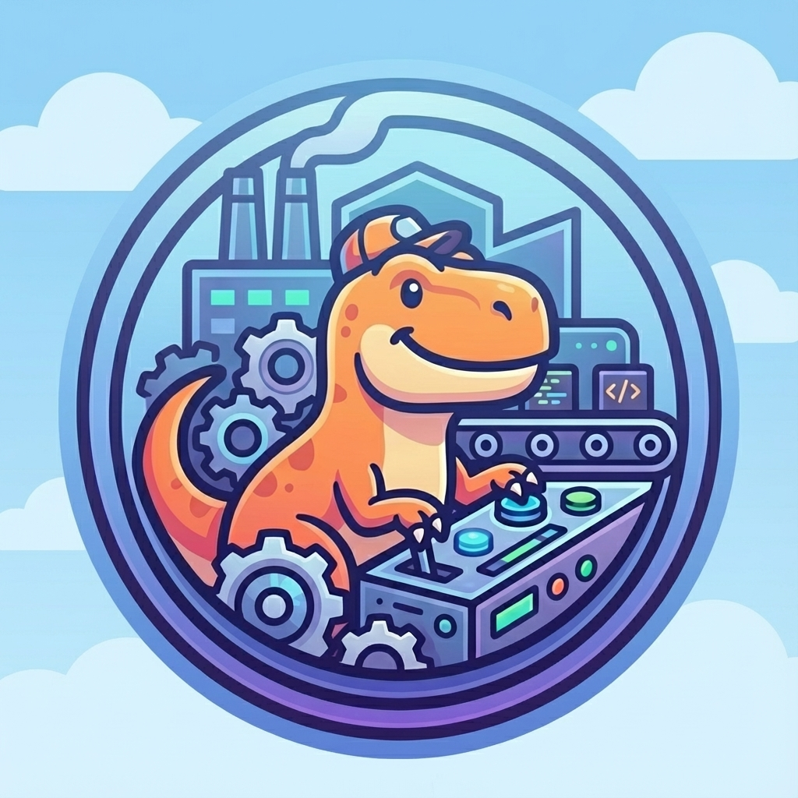

# Automatasaurus



An automated software development workflow powered by GitHub Copilot CLI. Uses specialized agents and skills to enable extended autonomous development sessions coordinated through GitHub issues and PRs.

## Quick Start

Get automatasaurus running in your project in under a minute:

```bash
# Prerequisites: GitHub Copilot CLI and GitHub CLI must be installed
# Install: https://docs.github.com/en/copilot/concepts/agents/about-copilot-cli and https://cli.github.com/

# Initialize in your project
cd your-project
npx automatasaurus init

# Begin discovery for a new feature
npx automatasaurus discovery "user authentication system"

# Review and sequence the implementation plan
npx automatasaurus work-plan

# Work through issues (optionally auto-merge when ready)
npx automatasaurus work-all --merge
```

That's it! The framework installs agents, skills, hooks, and slash commands into your project. See [Prerequisites](#prerequisites) for detailed setup instructions.

## Overview

Automatasaurus creates a team of AI agents that work together through GitHub issues and PRs to build software. Each agent has specific expertise and responsibilities, and they coordinate their work using established software development practices.

**This repository contains the workflow orchestration framework.** Install it into your project to enable AI-assisted software development with coordinated agents.

## Workflow

The workflow operates in two phases:

### Phase 1: Discovery (Interactive)

```
User: `npx automatasaurus discovery "feature description"`
    ↓
Discovery command facilitates conversation:
  - Goals and success metrics
  - Users and stakeholders
  - Business logic and constraints
  - Infrastructure requirements
    ↓
Brings in specialists for review:
  - Architect: Technical feasibility
  - Designer: UI/UX considerations
    ↓
Creates GitHub issues with:
  - User stories and acceptance criteria
  - Dependencies ("Depends on #X")
  - Organized into milestones
    ↓
User approves milestone/issue breakdown
  ↓
User: `npx automatasaurus work-plan` (analyze dependencies, create sequence)
  ↓
User: `npx automatasaurus work-all --merge`
```

### Phase 2: Autonomous Loop (Command Orchestrated)

```
┌─────────────────────────────────────────────────────────────────────┐
│ WORK-ALL ORCHESTRATION LOOP                                         │
│                                                                     │
│ 1. Select next issue                                                │
│    - Check dependencies (all deps closed?)                         │
│    - Consider priority labels                                       │
│    - Check circuit breaker limits                                  │
│                                                                     │
│ 2. Spawn /work {n} as subagent (context isolation)                 │
│    └→ Designer: Add specs if UI work needed                        │
│                                                                     │
│ 3. Developer: Implement                                             │
│    - Create branch: {issue-num}-{slug}                             │
│    - Commit frequently at logical checkpoints                      │
│    - If stuck (5 attempts) → Escalate to Architect                 │
│    - If Architect stuck → Notify human, wait                       │
│    - Open PR with "Closes #X"                                      │
│                                                                     │
│ 4. Review Cycle                                                     │
│    ├→ Architect: REQUIRED review                                   │
│    ├→ Designer: Review if UI-relevant (can decline "N/A")          │
│    └→ Developer: Address feedback, push fixes                      │
│                                                                     │
│ 5. Tester: Verification                                             │
│    - Run automated tests                                            │
│    - Manual verification if needed (Playwright)                    │
│    - If issues → Back to Developer                                 │
│                                                                     │
│ 6. Merge and continue                                               │
│    - Product Owner merges PR                                       │
│    - Loop until complete or limits reached                         │
└─────────────────────────────────────────────────────────────────────┘
```

## Agents

| Agent | Model | Role | Responsibilities |
|-------|-------|------|------------------|
| **Architect** | Opus | Design | System design, ADRs, required PR reviews, stuck-issue analysis |
| **Developer** | Sonnet | Implementation | Feature development, bug fixes, PRs, addresses feedback |
| **Designer** | Sonnet | Experience | UI/UX specs, accessibility, design reviews (if UI changes) |
| **Tester** | Sonnet | Quality | Test execution, Playwright verification, required PR reviews |

**Note:** Automatasaurus CLI commands (`discovery`, `work`, `work-all`) handle orchestration. There is no separate PM agent.

## Agent Comment Format

All agents prefix their comments with their identity:

```markdown
**[Product Owner]** Starting work on issue #5. Routing to Developer.
**[Developer]** Fixed in commit abc1234. Ready for re-review.
**[Architect]** ✅ APPROVED - Architect. Clean separation of concerns.
**[Designer]** N/A - No UI changes in this PR.
**[Tester]** ✅ APPROVED - Tester. All tests passing.
```

## Features

- **Stop Hooks**: Intelligent evaluation ensures tasks are complete before stopping
- **Subagent Coordination**: Specialized agents with role-specific completion criteria
- **GitHub Integration**: All work coordinated through issues, PRs, and labels
- **Playwright MCP**: Browser automation for E2E testing and visual verification
- **Notifications**: Desktop alerts when agents need attention or finish work
- **Escalation Flow**: Developer → Architect → Human (when stuck)
- **Language Skills**: On-demand coding standards for Python, JavaScript, CSS
- **Project Commands**: Configurable commands for any project stack
- **Extended Sessions**: Designed for autonomous work over extended periods

## Prerequisites

- [GitHub Copilot CLI](https://docs.github.com/en/copilot/concepts/agents/about-copilot-cli) installed and authenticated
- [GitHub CLI](https://cli.github.com/) (`gh`) installed and authenticated
- Node.js (for Playwright MCP and npm-based projects)

**GitHub CLI Setup:**
```bash
# Install (macOS)
brew install gh

# Authenticate
gh auth login

# Verify
gh auth status
```

## Project Structure

After running `npx automatasaurus init`, your project will have:

```
your-project/
├── .github/
│   ├── copilot-instructions.md   # Repo instructions for Copilot CLI (automatasaurus block merged in)
│   ├── automatasaurus-commands.md# Project commands (you edit this)
│   ├── agents/                  # Custom Copilot agents (symlinked)
│   └── skills/                  # Agent skills (symlinked)
├── .automatasaurus/             # Framework files (managed by installer)
│   ├── README.md                # Framework documentation
│   ├── agents/                  # AI agents
│   │   ├── architect.agent.md
│   │   ├── developer.agent.md
│   │   ├── designer.agent.md
│   │   ├── tester.agent.md
│   │   └── product-owner.agent.md
│   ├── skills/                  # Knowledge modules
│   │   ├── workflow-orchestration/
│   │   ├── github-workflow/
│   │   ├── github-issues/
│   │   ├── python-standards/
│   │   ├── javascript-standards/
│   │   ⋮                        # (additional skills)
│   ├── hooks/                   # Optional shell scripts for notifications
│   │   ├── notify.sh
│   │   ├── on-stop.sh
│   │   └── request-attention.sh
│   └── commands/                # Slash command definitions
│       ├── discovery.md
│       ├── work.md
│       ├── work-all.md
│       └── work-plan.md
```

**Note:** Files in `.automatasaurus/` are managed by the installer and updated via `npx automatasaurus update`. Add your own custom agents/skills directly to `.github/` (not as symlinks).

## Installation

### From npm (recommended)

```bash
# Initialize automatasaurus in your project
cd your-project
npx automatasaurus init
```

### From local build

To install from a local checkout (useful for testing changes before publishing):

```bash
# 1. In the automatasaurus repo, create the package tarball
cd ~/src/automatasaurus
npm pack
# Creates automatasaurus-0.1.0.tgz (version number from package.json)

# 2. In your target project, install the tarball
cd ~/src/your-project
npm install ~/src/automatasaurus/automatasaurus-0.1.0.tgz

# 3. Run the init command
npx automatasaurus init
```

**Note:** Use `npm install` (not `npx install`) to add the package, then `npx automatasaurus` to run the CLI.

This approach tests exactly what would be published to npm, catching any packaging issues like missing files.

### Updating from local build

When testing changes to automatasaurus, you need to reinstall the tarball before running update:

```bash
# 1. In the automatasaurus repo, create a new tarball
cd ~/src/automatasaurus
npm pack

# 2. In your target project, reinstall and update
cd ~/src/your-project
npm install ~/src/automatasaurus/automatasaurus-0.1.0.tgz
npx automatasaurus update --force
```

The `--force` flag is needed because the version number may not have changed. Without it, update will say "Already at latest version."

**Alternative:** Run directly from source without packing:
```bash
npx ~/src/automatasaurus update --force
```

### What init does

This will:
1. Copy framework files to `.automatasaurus/` directory
2. Create symlinks in `.github/` (agents + skills)
3. Merge automatasaurus config into `.github/copilot-instructions.md`
4. Create `.github/automatasaurus-commands.md` for your project-specific commands

After initialization:
1. Customize `.github/automatasaurus-commands.md` with your project's build/test commands
2. Ensure GitHub CLI is authenticated: `gh auth status`
3. Ensure Copilot CLI is authenticated

### CLI Commands

```bash
npx automatasaurus init      # Install into current project
npx automatasaurus update    # Update framework files to latest
npx automatasaurus status    # Show installation info
```

## Usage

### CLI Commands

The primary way to invoke workflows:

| Command | Description |
|---------|-------------|
| `npx automatasaurus discovery "..."` | Start discovery to understand requirements and create plan |
| `npx automatasaurus work-plan` | Analyze open issues, create sequenced implementation plan |
| `npx automatasaurus work-all` | Work through open issues |
| `npx automatasaurus work <issue#>` | Work on a specific issue |

### `automatasaurus discovery` - Discovery Mode

```
```bash
npx automatasaurus discovery "user authentication system"
```
```

The discovery command will:
- Lead a conversation about goals, constraints, and requirements
- Bring in specialists (Architect, Designer) for review
- Create well-formed GitHub issues with acceptance criteria
- Organize issues into milestones
- Get your approval before any implementation

### `automatasaurus work-plan` - Implementation Planning

```
```bash
npx automatasaurus work-plan
```
```

Before starting autonomous work, run this command to:
- Analyze all open issues and their dependencies
- Create a sequenced implementation plan
- Generate `implementation-plan.md` with work order and rationale
- Identify blockers and risks

This step helps you review and approve the execution order before `work-all` begins.

### `automatasaurus work-all` - Autonomous Loop

```
```bash
npx automatasaurus work-all --merge
```
```

The orchestrator (aka Product Owner) will:
- List all remaining issues
- Select next issue based on dependencies and priority
- Spawn `/work {n}` as a subagent for context isolation
- Merge successful PRs
- Continue until all issues complete or circuit breaker limits reached

**Circuit Breaker Limits** (configurable via environment variables):
- `maxIssuesPerRun`: 20 - Stop after this many issues
- `maxEscalationsBeforeStop`: 3 - Stop if stuck too many times
- `maxConsecutiveFailures`: 3 - Stop if failing repeatedly

### `/work` - Single Issue

```
/work 42
```

Work on a specific issue - useful for one-off tickets or addressing a particular issue outside the full autonomous loop:
- Checks dependencies are satisfied
- Gets design specs if UI work is involved
- Developer implements and opens PR
- Coordinates reviews (Architect required, Designer if UI)
- Tester verifies
- Stops after that issue is complete (does not auto-merge)

### Invoking Specific Agents

You can also invoke agents directly:

```
Use the architect agent to review the database schema
Use the tester agent to create a test plan for the API
Use the tester agent with playwright to verify the checkout flow
```

## Dependency Tracking

Issues track dependencies in their body:

```markdown
## Dependencies
Depends on #12 (User authentication)
Depends on #15 (Database schema)
```

The PM uses this to determine issue order - an issue is only "ready" when all dependencies are closed.

## State Labels

| Label | Description |
|-------|-------------|
| `ready` | No blocking dependencies, can be worked |
| `in-progress` | Currently being implemented |
| `blocked` | Waiting on dependencies or input |
| `needs-review` | PR open, awaiting reviews |
| `needs-testing` | Reviews complete, awaiting tester |
| `priority:high/medium/low` | Work order priority |

## Escalation Flow

When the Developer gets stuck after 5 attempts:

```
Developer stuck
    ↓
Escalate to Architect
    ↓
Architect analyzes and provides guidance
    ↓
If Architect also stuck → Notify human and wait
```

## Notifications

Agents send desktop notifications when they need your attention:

| Type | Trigger | Sound |
|------|---------|-------|
| **Question** | Agent has a blocking question | Submarine |
| **Approval** | PR or decision needs approval | Submarine |
| **Stuck** | Agent encountered an issue | Basso |
| **Complete** | All work finished | Hero |

## Configuration

### Project Commands

Edit `.github/automatasaurus-commands.md` for your project's commands:

```markdown
## Quick Reference

| Action | Command |
|--------|---------|
| Install dependencies | `npm install` |
| Start development server | `npm run dev` |
| Run all tests | `npm test` |
| Run E2E tests | `npx playwright test` |
```

### MCP Servers

The `.mcp.json` file configures Playwright for browser testing:

```json
{
  "mcpServers": {
    "playwright": {
      "command": "npx",
      "args": ["@playwright/mcp@latest"]
    }
  }
}
```

### Circuit Breaker Limits

Customize limits via environment variables (per machine):

```json
{
  "automatasaurus": {
    "limits": {
      "maxIssuesPerRun": 50
    }
  }
}
```

Default values:
- `maxIssuesPerRun`: 20
- `maxEscalationsBeforeStop`: 3
- `maxRetriesPerIssue`: 5
- `maxConsecutiveFailures`: 3

**Note:** Don't edit `settings.json` directly—your changes will be overwritten on update. Use `settings.local.json` for all customizations.

### Notifications

Configure notification behavior via environment variables:

```bash
# Disable sound alerts
export AUTOMATASAURUS_SOUND=false

# Custom log location
export AUTOMATASAURUS_LOG=/path/to/log
```

## Language Skills

The developer agent loads language-specific skills on demand:

| Language | Skill | Covers |
|----------|-------|--------|
| Python | `python-standards` | PEP 8, type hints, pytest, async patterns |
| JavaScript/TypeScript | `javascript-standards` | ESM, React, testing, error handling |
| CSS/SCSS | `css-standards` | BEM, CSS variables, flexbox/grid, accessibility |

## Customization

### Adding a New Agent

1. Create `.github/agents/<agent-name>.agent.md`
2. Add YAML frontmatter with `name` and `description`
3. Write a detailed prompt below the frontmatter
4. Update `.github/copilot-instructions.md` if you want repo-wide conventions

### Creating Skills

1. Create `.github/skills/<skill-name>/SKILL.md`
2. Add frontmatter:
   ```yaml
   ---
   name: skill-name
   description: What this skill does and when to use it
   ---
   ```
3. Document the workflow or knowledge
4. Skills are loaded on-demand when relevant

## Roadmap

- [x] CLI tool for easy installation (`automatasaurus init`)
- [ ] Project detection and automatic command configuration
- [ ] Additional MCP integrations (database, API testing)
- [ ] Custom agent templates
- [ ] Workflow visualization
- [ ] Integration with CI/CD

## Contributing

Contributions welcome:
- New agent definitions
- Improved stop hook prompts
- Additional skills and language standards
- Workflow patterns
- CLI tool development

## Publishing to npm

```bash
npm publish --auth-type=web
```

This opens a browser for authentication (works with passkeys/security keys).

## References

- [About GitHub Copilot CLI](https://docs.github.com/en/copilot/concepts/agents/about-copilot-cli)
- [Using GitHub Copilot CLI](https://docs.github.com/en/copilot/how-tos/use-copilot-agents/use-copilot-cli)
- [Creating custom agents](https://docs.github.com/en/copilot/how-tos/use-copilot-agents/coding-agent/create-custom-agents)
- [About Agent Skills](https://docs.github.com/en/copilot/concepts/agents/about-agent-skills)
- [Playwright MCP](https://github.com/microsoft/playwright-mcp)
- [GitHub CLI](https://cli.github.com/)
- [Best Practices](https://www.anthropic.com/engineering/claude-code-best-practices)

## License

This project is licensed under the [MIT License](LICENSE).
